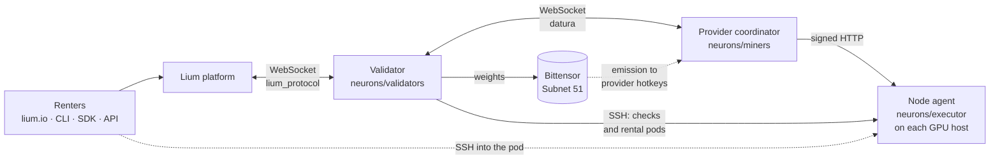

<p align="center">
  
</p>

<h1 align="center">Lium</h1>

<p align="center"><strong>The decentralized GPU cloud on Bittensor Subnet 51.</strong></p>

<p align="center">
  <a href="https://github.com/Datura-ai/lium-io/actions/workflows/test.yml"></a>
  <a href="https://taomarketcap.com/subnets/51"></a>
  <a href="https://pypi.org/project/lium.io/"></a>
  <a href="https://discord.gg/lium"></a>
  <a href="LICENSE"></a>
</p>

Lium is a GPU rental marketplace. Providers around the world list their NVIDIA GPUs, and renters (people, teams and AI agents) rent them by the hour at [lium.io](https://lium.io), from the web, the `lium` CLI, the Python SDK or the API. Every node is checked by the Subnet 51 validator every 15 minutes: hardware, GPU, network, ports and a Sysbox-isolated container runtime. Only nodes that pass are listed. Providers earn twice: a share of what renters pay, and Bittensor emission for their nodes, including idle pay for eligible GPUs that are not rented. This repository holds the code that runs on providers' machines (the node agent and the miner) and the validator that scores them.

## Quick links

| | |
|---|---|
| Rent a GPU | [lium.io](https://lium.io) |
| Documentation | [docs.lium.io](https://docs.lium.io) ([providers](https://docs.lium.io/providers), [validators](https://docs.lium.io/validators), [renters](https://docs.lium.io/pod-users), [developers](https://docs.lium.io/developers)) |
| Provider Portal | [provider.lium.io](https://provider.lium.io) (add nodes, set prices, see earnings) |
| Rewards calculator | [provider.lium.io/rewards-calculator](https://provider.lium.io/rewards-calculator) |
| CLI and Python SDK | [Datura-ai/lium](https://github.com/Datura-ai/lium): `pip install lium.io` ([CLI docs](https://docs.lium.io/developers/cli/overview), [SDK docs](https://docs.lium.io/developers/sdk)) |
| Community and support | [Discord](https://discord.gg/lium), and for account help, a private ticket in [`#tickets`](https://discord.com/channels/1350984082733142026/1547193098969284650) |

## For renters

Sign up at [lium.io](https://lium.io), pick a GPU, and SSH into your pod. From a terminal:

```bash
pip install lium.io
lium init   # saves your API key
lium ls     # GPUs available now, with prices
```

Next steps: the [renter quickstart](https://docs.lium.io/pod-users/quickstart), the [CLI quickstart](https://docs.lium.io/developers/cli/quickstart), or [AI agents](https://docs.lium.io/developers/agents) for the fully headless path.

## For providers

Docs and the Provider Portal call a miner a **provider** and an executor a **node**.

**Why list your GPUs on Lium**

- **Two income streams.** You list each node at your own price per GPU-hour and get a share of what renters pay. On top of that, your hotkey earns Subnet 51 emission for rented nodes. See [How providers earn](https://docs.lium.io/providers/rewards).
- **Idle pay.** An eligible GPU that is not rented still earns from the unrented pool (see [How incentives work](#how-incentives-work)).
- **No coordinator server required.** Opt into the Lium.io Central Provider Server and all you run is the node agent on each GPU host.
- **One-command setup.** `lium mine` installs, configures and checks a node, then prints the values for the portal's **Add Node** form.

### Requirements

Per GPU host (the full list is in the [Node Quickstart](https://docs.lium.io/providers/nodes/quickstart#requirements)):

- **OS:** Ubuntu 24.04, or Ubuntu 22.04 with the HWE kernel. Sysbox needs kernel 5.19 or newer.
- **GPU:** an NVIDIA model on the [supported list](https://docs.lium.io/providers/architecture#supported-gpus) (the validator's source of truth is `GPU_MODEL_RATES` in [`neurons/validators/src/services/const.py`](neurons/validators/src/services/const.py)), with the driver installed (`nvidia-smi` works).
- **Docker Engine**, installed and running.
- **Network:** a public IP and at least **100 Mbps download**, as measured by the validator.
- **Hardware:** at least 8 GB RAM and 100 GB free disk. For idle pay, total disk must be at least **1.5× total GPU VRAM**.
- **A registered hotkey** on Subnet 51 (below). Keep your coldkey off the server.

### Ports

| Port | Default | Who connects | Set in `neurons/executor/.env` |
|---|---|---|---|
| Node service (HTTP) | `8080` with `lium mine` (`8001` in the template) | The provider coordinator (yours or the Central Provider Server) | `EXTERNAL_PORT` / `INTERNAL_PORT` |
| Node SSH | `2200` | The validator | `SSH_PORT`, plus `SSH_PUBLIC_PORT` when NAT forwards a different public port |
| Renting ports | All ports | Renters' pods | `RENTING_PORT_RANGE` (like `40000-40100`) or, behind NAT, `RENTING_PORT_MAPPINGS`. Set one, never both. **At least 3 must be reachable from the internet.** |

A self-hosted coordinator also needs its own `EXTERNAL_PORT` (default `8000`) open to the validator; see [`neurons/miners/README.md`](neurons/miners/README.md).

### Install

1. **Register a hotkey** on Subnet 51, from your own machine and not the GPU host. The fee is dynamic ([check it here](https://taomarketcap.com/subnets/51/registration)).

   ```bash
   btcli subnet register --netuid 51 --wallet.name <wallet> --wallet.hotkey <hotkey>
   ```

2. **Set up the Provider Portal.** Sign in at [provider.lium.io](https://provider.lium.io/signature-login) with that hotkey. In [Profile Settings](https://provider.lium.io/settings), select **Lium.io Central Provider Server** under **Central Provider**, and [connect Discord](https://docs.lium.io/providers/portal/discord). A provider without a connected Discord account earns no incentive. To run the coordinator yourself instead, follow [Self-hosted provider](https://docs.lium.io/providers/self-hosted-provider).

3. **Install Sysbox and the NVIDIA Container Toolkit** on the GPU host. Validators reject a node without the `sysbox-runc` runtime. The installer checks the host first and prints a `PASS`, `FIX` or `SKIP` line per requirement.

   ```bash
   curl -fsSL https://raw.githubusercontent.com/Datura-ai/lium-io/main/neurons/executor/nvidia_docker_sysbox_setup.sh | sudo bash
   docker run --rm --runtime=sysbox-runc --gpus all daturaai/compute-subnet-executor:latest nvidia-smi
   ```

4. **Start the node** with your hotkey's SS58 address. It prompts for the ports above. Add `--auto` to accept the defaults.

   ```bash
   curl -fsSL https://lium.io/mine.sh | bash -s -- -k <your_provider_hotkey_ss58>
   ```

   The script installs the `lium` CLI and runs `lium mine`, which clones this repository, writes `neurons/executor/.env`, starts the node with `docker compose up -d` and runs the validator's own check against it.

5. **Add the node** in the portal: **Add Node**, then paste the GPU type, GPU count, IP and port that `lium mine` printed, and set your price per GPU-hour.

To set every value by hand, use the [manual setup](neurons/executor/README.md#manual-setup). A running node updates itself; see [`EXECUTOR_UPDATE.md`](neurons/executor/EXECUTOR_UPDATE.md).

### Check that your node is listed

- **Provider Portal:** a new node shows **VALIDATION PENDING**, then **AVAILABLE** once the validator has checked it and published the cycle. The validator runs every 15 minutes. If the node is still pending after an hour, see [Troubleshooting](https://docs.lium.io/providers/troubleshooting#a-newly-added-node-stuck-in-validation_pending).
- **Public feed:** every node that renters can rent right now is in [`lium.io/api/public/v1/nodes`](https://docs.lium.io/developers/public-nodes-feed). Use the node ID from its portal page (`provider.lium.io/executors/<node-id>`). A fully rented node leaves the feed until a GPU frees up.

  ```bash
  curl -s https://lium.io/api/public/v1/nodes | jq '.nodes[] | select(.id == "<node-id>")'
  ```

- **Why it is not earning:** the node's detail page shows the validator's last reason code, and the [Job Logs dashboard](https://grafana.lium.io/d/aejriu31349hcb/job-logs) has every check's full message.

### Common failures

| What you see | Cause | Fix |
|---|---|---|
| Stuck at `VALIDATION PENDING`, then `NOT_DETECTED`, with no errors | The account has no coordinator, so no check ever runs | Select the Central Provider Server in [Profile Settings](https://provider.lium.io/settings), or start your self-hosted miner |
| `INSUFFICIENT_PORTS` | Fewer than 3 renting ports are reachable from the validator | Open `RENTING_PORT_RANGE` on the firewall or NAT, or widen it, then `docker compose up -d` in `neurons/executor` |
| `PORT_VERIFY_FAILED` | A port the validator mapped is closed, or NAT forwards a different external port | Behind NAT, list the pairs in `RENTING_PORT_MAPPINGS` (internal, external) and leave `RENTING_PORT_RANGE` unset |
| SSH errors or `UPLOAD_FAILED` | The node SSH port (`2200`) is not reachable from outside | Open it, or set `SSH_PUBLIC_PORT` to the port your NAT forwards |
| Job Logs mention `sysbox-runc` | Sysbox is missing or not working | Rerun step 3; see [Sysbox](https://docs.lium.io/providers/nodes/sysbox) |
| `VERIFYX_FAILED_NETWORK_SPEED_TOO_SLOW` | Download speed below 100 Mbps | Reproduce it with the [VerifyX benchmark](https://docs.lium.io/providers/troubleshooting#2-run-the-verifyx-benchmark-to-reproduce-validator-checks), then fix the uplink |
| No idle pay, and the reason mentions disk | Total disk is below 1.5× total GPU VRAM | Add disk; see [Docker storage](https://docs.lium.io/providers/nodes/docker-storage) |

Every reason code and its fix: [Troubleshooting → Validator reason codes](https://docs.lium.io/providers/troubleshooting#6-validator-reason-codes). Still stuck? Open a ticket in [`#tickets`](https://discord.com/channels/1350984082733142026/1547193098969284650). Never share a seed phrase, private key or coldkey with anyone who offers help ([how support scams work](https://docs.lium.io/security/official-support-and-scams)).

## For validators

Subnet 51 has one validator, operated by the Lium team (hotkey `5F7X5UpKSr26KU3jKfpLmT8kuKtBNyHhEnfS8xtxPCqCb13p`). Nodes accept checks only from the validator hotkeys compiled into the node image, so a second copy of `neurons/validators` cannot check nodes on mainnet.

To take part in consensus, run the community auditor, [Datura-ai/sn51-auditor](https://github.com/Datura-ai/sn51-auditor). It reads the latest validated results from the lium.io public endpoint, audits them, and sets weights from your hotkey. It needs one CPU core, 256 MB of RAM, Python 3.11+ and a hotkey registered on Subnet 51. Bittensor also requires a validator permit to set weights.

```bash
git clone https://github.com/Datura-ai/sn51-auditor.git && cd sn51-auditor
pip install bittensor requests
python3 auditor.py <wallet_name> <hotkey_name>
```

The validator code here is open so anyone can read what it checks and how it scores. [`neurons/validators/README.md`](neurons/validators/README.md) covers running it for Lium's own deployments and on testnet. Validator docs: [docs.lium.io/validators](https://docs.lium.io/validators).

## Architecture



- **Node agent** (`neurons/executor/`) runs on each GPU host. It lets the validator in over SSH with a key the coordinator installs, and runs renters' pods under Sysbox. `dstacktee/` runs it in an Intel TDX confidential VM with attestation.
- **Provider coordinator**, the miner (`neurons/miners/`), runs on a small CPU server, or as the Central Provider Server that Lium operates for providers who opt in. It holds the provider's hotkey, lists its nodes to the validator, and installs the validator's SSH key on them.
- **Validator** (`neurons/validators/`): every 15 minutes it asks each coordinator for its nodes, checks each node over SSH (hardware, GPU, network, ports), creates and removes rental pods for the platform, reports results to the platform, and sets weights on chain.
- **Shared code:** `datura/` (the validator-to-miner messages), `lium_protocol/` (the versioned validator-to-platform protocol), `packages/lium-core/` (the shared-config client, published to PyPI as `lium-core`), `watchtower/` (pulls signed image updates), and `e2e/` (the whole loop on one machine, no chain).

More detail: [provider architecture](https://docs.lium.io/providers/architecture).

## How incentives work

A provider earns in two ways. The rates move with the market, so the [rewards calculator](https://provider.lium.io/rewards-calculator) has the live figures.

1. **Rental fees.** The renter pays per GPU-hour at the price the provider set. The platform pays the provider's share to their coldkey once a day ([Rental fees](https://docs.lium.io/providers/rewards/rental-fees), [Payouts](https://docs.lium.io/providers/rewards/payouts)).
2. **Subnet emission.** Each cycle the validator scores every node and sets weights on chain, and Bittensor pays alpha to provider hotkeys every tempo. The validator splits the emission three ways:
   - **Rented pool:** nodes that are rented right now, scored by GPU model and count.
   - **Unrented pool:** idle nodes of an eligible GPU model, paid by what that GPU earns when rented. Among the conditions: the node passes validation, its price is at or below the market soft limit, its disk is at least 1.5× its VRAM, its container can set a GPU power limit, and its GPU count has a priced tier. An 8× H200, B200 or B300 node must also offer GPU splitting, GPU profiling or an attested confidential VM.
   - **Burn:** the rest. The validator reads the ceiling for the unrented and burn pools from the platform's shared config (`total_burn_emission` at [lium.io/api/v1/shared-config](https://lium.io/api/v1/shared-config)) at the start of every cycle.

A node that fails validation, or runs the provider's own default job, earns nothing that cycle. Every reason a node can earn 0, with the exact message the provider sees, is listed in [`incentive/miner_incentive_log.py`](neurons/validators/src/incentive/miner_incentive_log.py). The pool logic is in [`incentive/rental_price.py`](neurons/validators/src/incentive/rental_price.py). The full explanation is in [Subnet emission](https://docs.lium.io/providers/rewards/emission) and [Penalties](https://docs.lium.io/providers/rewards/penalties).

## Contributing

Issues and pull requests are welcome. Open an [issue](https://github.com/Datura-ai/lium-io/issues) first for anything larger than a small fix. [`contrib/CONTRIBUTING.md`](contrib/CONTRIBUTING.md) covers the workflow, the test command for each service, and how releases are cut. Each service is its own [pdm](https://pdm-project.org) project on Python 3.11. For example, the validator suite:

```bash
cd neurons/validators && pdm install && \
BITTENSOR_WALLET_NAME=test_wallet BITTENSOR_WALLET_HOTKEY_NAME=test_hotkey \
SQLALCHEMY_DATABASE_URI=sqlite:///test.db ASYNC_SQLALCHEMY_DATABASE_URI=sqlite+aiosqlite:///test.db \
ENABLE_TDX_ATTESTATION=True TDX_VERIFIER_URL=http://localhost:8000/verify \
pdm run pytest tests/ --tb=short --strict-markers
```

## Security

Please report vulnerabilities privately through [GitHub Security Advisories](https://github.com/Datura-ai/lium-io/security/advisories/new), not in a public issue or on Discord. Include the affected component (node, miner or validator), steps to reproduce, and the impact.

## License

Released under the [MIT License](LICENSE).
