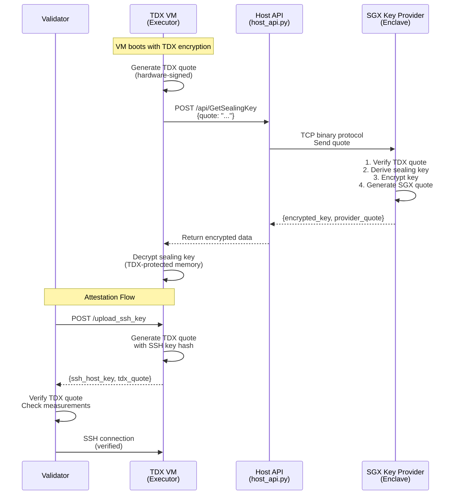

# DStack TDX Executor Setup

Run compute subnet executors inside Intel TDX confidential VMs with hardware attestation.

## Prerequisites

- Intel CPU with TDX and SGX support
- Kernel with KVM TDX (Canonical intel kernel or mainline ≥ 6.16) and the boot parameters — applied for you by `ansible/bootstrap.sh`, see [docs/host-setup.md](docs/host-setup.md)
- Docker and Docker Compose
- The dstack QEMU 9.2.1 build — **required for attestation to pass**; built for you by `ansible/bootstrap.sh`, see [docs/host-setup.md](docs/host-setup.md)
- SGX devices: `/dev/sgx_enclave` and `/dev/sgx_provision`

First-time host? Run the host bring-up first — one command, safe to re-run:

```bash
cd ../ansible && sudo ./bootstrap.sh
```

It covers kernel parameters, GPU confidential-compute mode, the QEMU build, Docker, SGX and the key provider, and it names any BIOS setting it cannot change itself. See [../ansible/README.md](../ansible/README.md) and [docs/host-setup.md](docs/host-setup.md). The steps below assume a prepared host.

## Quick Start

### 1. Check System Requirements

```bash
./lium-cvm.sh check
```

### 2. Download OS Image

```bash
./lium-cvm.sh download
```

### 3. Configure Environment

```bash
cp .env.example .env
# Edit .env with your settings:
# - MINER_HOTKEY_SS58_ADDRESS
# - SSH_PORT
# - RENTING_PORT_RANGE
# - CVM_VCPUS, CVM_MEMORY, CVM_DISK
# - CVM_GPUS (e.g., "all" or "19:00.0,3b:00.0")
```

### 4. Create CVM Instance

```bash
./lium-cvm.sh new my-executor
```

### 5. Run CVM

```bash
./lium-cvm.sh run my-executor
```

## Architecture



## Key Components

| Component | Purpose |
|-----------|---------|
| `lium-cvm.sh` | CLI for creating and running CVMs |
| `scripts/dstack.py` | VM manifest generator and QEMU orchestrator |
| `scripts/host_api.py` | HTTP API bridge between VM and key provider |
| `key-provider/` | SGX enclave containers for sealing key derivation |
| `app/init_script.sh` | VM boot script for env var whitelisting + RTMR extension |
| `app/docker-compose.yml` | Executor services running inside the VM |

## Configuration

Key `.env` settings:

```bash
# Network
SSH_PORT=2200
RENTING_PORT_RANGE="19001,19002,19003"

# Identity
MINER_HOTKEY_SS58_ADDRESS=your_hotkey_here
ENABLE_TDX_ATTESTATION=true

# Measured executor-runner release (from the release notes) — required
EXECUTOR_RUNNER_IMAGE_DIGEST=sha256:...

# Resources
CVM_VCPUS=16
CVM_MEMORY=64G
CVM_DISK=200G
CVM_GPUS=all  # or "19:00.0,3b:00.0"
```

## How It Works

1. **TDX VM** provides hardware-encrypted memory and attestation quotes
2. **SGX Key Provider** derives deterministic sealing keys from VM measurements
3. **Host API** bridges the VM to the key provider (VM can't talk to SGX directly)
4. **Sealing Key** allows the VM to persist secrets across reboots
5. **TDX Quote** proves to validators that the executor runs in genuine TDX hardware

## Troubleshooting

**Check key provider status:**
```bash
cd key-provider && docker compose logs -f
```

**List running VMs:**
```bash
./lium-cvm.sh list
```

**Check GPU allocation:**
```bash
./lium-cvm.sh lsgpu
```

## Security Model

- VM memory encrypted by Intel TDX hardware
- Sealing keys derived in SGX enclave (host cannot access)
- TDX quotes cryptographically bind SSH keys to VM measurements
- Validators verify quotes before accepting executors
